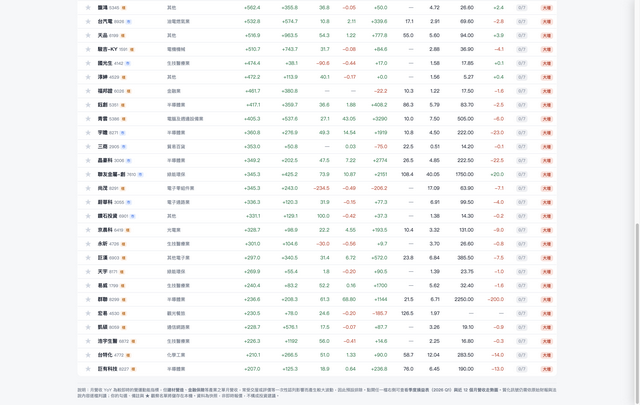

# TW Stock Screener

Taiwan stock screening tool for filtering companies by revenue growth, profitability, EPS, valuation, and industry signals.



## Overview

TW Stock Screener is a single-page stock screening app focused on Taiwan-listed companies. It combines monthly revenue growth, quarterly earnings, valuation data, and sector context into one interface for fast filtering and follow-up research.

The UI is built as a static HTML app, while the latest dataset is served through lightweight serverless endpoints. When live data is unavailable, the app falls back to a bundled local snapshot so the screen still works.

## Features

- Filter Taiwan stocks by revenue YoY, YTD YoY, gross margin, positive EPS, market, and industry.
- Sort and search across the screened list.
- Track watchlist items with local starred companies, notes, and phrase checklists stored in `localStorage`.
- Inspect a per-stock detail drawer with charts, valuation data, EPS history, and reference links.
- Refresh the latest dataset through a protected API endpoint when deployment secrets are configured.

## Data Pipeline

- `index.html` contains the client UI shell and loads `assets/app/seed-snapshot.js` for offline or file-based viewing.
- `api/snapshot.js` serves the best available snapshot with `no-store` caching.
- `api/refresh.js` rebuilds the dataset from TWSE, TPEx, and MOPS sources, then writes the result to Vercel Blob storage.
- `lib/snapshot-store.js` loads from Vercel Blob first and falls back to `data/latest-snapshot.json` if Blob storage is unavailable.
- `data/latest-snapshot.json` and `assets/app/seed-snapshot.js` are kept in sync for local refresh and static-file fallback.
- `vercel.json` defines the serverless function limits and the scheduled refresh job.

## Local Development

### Prerequisites

- Node.js 24.x
- Vercel CLI is required before `npm run dev:vercel` can run successfully.

### Install

```bash
npm install
```

### Refresh the local snapshot

```bash
npm run refresh:local
```

### Sync the bundled file-mode snapshot only

```bash
npm run sync:seed
```

Use this when `data/latest-snapshot.json` has already been updated and you only want to regenerate `assets/app/seed-snapshot.js` for `file://` fallback verification.

### Daily Node workflow

Set `REFRESH_SECRET` before testing `/api/refresh`, because the local refresh endpoint expects a bearer token that matches `REFRESH_SECRET` or `CRON_SECRET`.

```bash
REFRESH_SECRET=your-secret npm run dev
```

`npm run dev` starts the pure Node.js local server at `http://127.0.0.1:3000` by default. This workflow serves:

- `/` for the static app shell
- `/api/snapshot` for the latest local snapshot payload
- `/api/refresh` for rebuilding data and writing the refreshed snapshot back to `data/latest-snapshot.json`

This is the daily local development path when you want to work against the app and API routes without going through the Vercel runtime.
`npm run dev` intentionally reads the local snapshot file directly; if you need the Blob-first "best snapshot" behavior, use `npm run dev:vercel`.

### Vercel compatibility verification

```bash
npm run dev:vercel
```

`npm run dev:vercel` runs `vercel dev` and is the formal compatibility check for the deployed runtime. It should be used to verify that the local behavior still matches the intended Vercel execution path, including the Blob-backed snapshot strategy.

Because `npm run dev:vercel` shells out to the Vercel CLI, installing and authenticating `vercel` is a prerequisite for this verification mode.

### Static file fallback

You can still open `index.html` directly in a browser. In file mode, the page works with the bundled snapshot loaded from `assets/app/seed-snapshot.js`, but there is no live `/api/snapshot` or `/api/refresh` behavior.

## Environment Variables

- `BLOB_READ_WRITE_TOKEN`: Required for reading and writing the latest snapshot in Vercel Blob.
- `CRON_SECRET`: Optional secret for authorizing scheduled refresh requests.
- `REFRESH_SECRET`: Optional secret for manual refresh requests from the UI.
- `SNAPSHOT_BLOB_PATH`: Optional Blob path override. Defaults to `twse-screener/latest.json`.

## Validation

```bash
npm test
npm run check:ui
npm run check:deploy
```

Use `npm run dev` for the daily Node-based smoke test, then `npm run dev:vercel` when the Vercel CLI is available and you need the deployment-compatible verification path.

## Data Sources

- TWSE open data
- TPEx open data
- MOPS monthly revenue and income statement data

## Deployment Notes

- The project is configured for Vercel.
- Deployments are triggered from GitHub Actions instead of Vercel's built-in Git integration.
- Add these repository secrets before enabling the workflow: `VERCEL_TOKEN`, `VERCEL_ORG_ID`, and `VERCEL_PROJECT_ID`.
- Pushes to non-`main` branches create Vercel preview deployments; pushes to `main` create the production deployment.
- `vercel.json` disables Vercel's native Git auto-deploy so the GitHub workflow remains the single deployment path.
- Scheduled refresh is defined in `vercel.json`.
- Historical HTML snapshots under `versions/` are kept in the repository, but excluded from Vercel deployment via `.vercelignore`.
